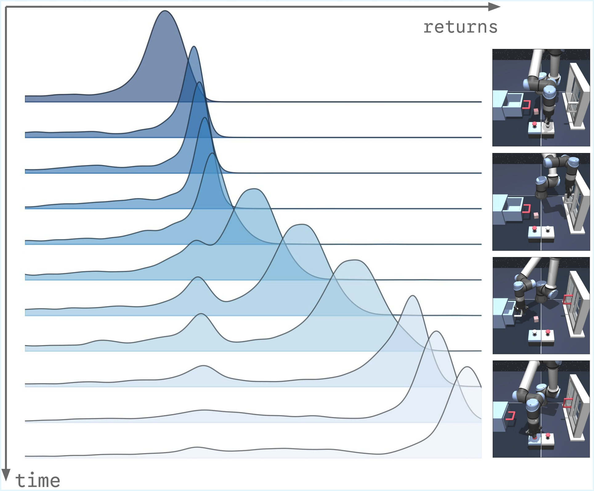

<div align="center">

<div id="user-content-toc" style="margin-bottom: 50px">
  <ul align="center" style="list-style: none;">
    <summary>
      <h1 style="font-size:1.76rem">
        Value Flows
      </h1>
      <br>
      <h2>
        <a href="" style="font-size:20px;">Paper</a>&emsp;
        <a href="https://perry-dong.github.io/value-flows" style="font-size:20px;">Website</a>
      </h2>
    </summary>
  </ul>
</div>




</div>

## Overview

Value Flows is an RL algorithm using flow-matching methods to model the return distribution.

This repository contains code for running the Value Flows algorithm and four baselines: FBRAC, C51, IQN, and CODAC. For other baselines, the implementations can be found in the official [FQL](https://github.com/seohongpark/fql) repository.

## Installation

1. Create an Anaconda environment: `conda create -n value-flows python=3.10.13 -y`
2. Activate the environment: `conda activate value-flows`
3. Install the dependencies:
   ```
   conda install -c conda-forge glew -y
   conda install -c conda-forge mesalib -y
   pip install -r requirements.txt
   ```
3. Setup `MuJoCo 2.1.0` for D4RL environments
   ```
   mkdir ~/.mujoco
   cd ~/.mujoco
   wget https://roboti.us/file/mjkey.txt
   wget https://github.com/google-deepmind/mujoco/releases/download/2.1.0/mujoco210-linux-x86_64.tar.gz
   tar -xvzf mujoco210-linux-x86_64.tar.gz
   rm mujoco210-linux-x86_64.tar.gz
   ```
4. Export environment variables
   ```
   export LD_LIBRARY_PATH=$LD_LIBRARY_PATH:/usr/lib/nvidia:/home/cz8792/.mujoco/mujoco210/bin
   export PYTHONPATH=path_to_value_flows_dir
   export MUJOCO_GL=egl
   export PYOPENGL_PLATFORM=egl
   ```

## Running experiments

The `agents` folder contains the implementation of algorithms and default hyperparameters. Here are some example commands to run experiments:

```
# Value Flows on OGBench scene-play (offline RL)
python main.py --env_name=scene-play-singletask-{task1, task2, task3, task4, task5}-v0 --agent=agents/value_flows.py --agent.confidence_weight_temp=0.3 --agent.ret_agg=min

# Value Flows on D4RL hammer-cloned (offline RL)
python main.py --env_name=hammer-cloned-v1 --agent=agents/value_flows.py --agent.bcfm_lambda=3.0 --agent.confidence_weight_temp=0.3 --agent.q_agg=min

# Value Flows on OGBench visual-cube-double-play (offline RL)
python main.py --env_name=visual-cube-double-play-singletask-{task1, task2, task3, task4, task5}-v0 --p_aug=0.5 --frame_stack=3 --agent=agents/value_flows.py --agent.discount=0.995 --agent.confidence_weight_temp=0.3 --agent.encoder=impala_small

# Value Flows on OGBench scene-play (offline-to-online RL)
python main.py --env_name=cube-double-play-singletask-task2-v0 --online_steps=1000000 --agent=agents/value_flows.py --agent.discount=0.995 --agent.confidence_weight_temp=3.0
```

We include the complete hyperparameters for each method below.

### Value Flows

<details>
<summary><b>Click to expand the full list of commands</b></summary>

```
# Value Flows on OGBench tasks
python main.py --env_name=cube-double-play-singletask-{task1, task2, task3, task4, task5}-v0 --agent=agents/value_flows.py --agent.discount=0.995 --agent.confidence_weight_temp=3
python main.py --env_name=puzzle-3x3-play-singletask-{task1, task2, task3, task4, task5}-v0 --agent=agents/value_flows.py --agent.bcfm_lambda=0.5 --agent.confidence_weight_temp=0.3 --agent.ret_agg=min
python main.py --env_name=scene-play-singletask-{task1, task2, task3, task4, task5}-v0 --agent=agents/value_flows.py --agent.confidence_weight_temp=0.3 --agent.ret_agg=min
python main.py --env_name=puzzle-4x4-play-singletask-{task1, task2, task3, task4, task5}-v0 --agent=agents/value_flows.py --agent.bcfm_lambda=3.0 --agent.confidence_weight_temp=100 --agent.q_agg=min
python main.py --env_name=cube-triple-play-singletask-{task1, task2, task3, task4, task5}-v0 --agent=agents/value_flows.py --agent.discount=0.995 --agent.bcfm_lambda=3.0 --agent.confidence_weight_temp=0.03

# Value Flows on visual OGBench tasks
python main.py --env_name=visual-antmaze-medium-navigate-singletask-{task1, task2, task3, task4, task5}-v0 --p_aug=0.5 --frame_stack=3 --agent=agents/value_flows.py --agent.bcfm_lambda=0.3 --agent.confidence_weight_temp=0.03 --agent.encoder=impala_small
python main.py --env_name=visual-antmaze-teleport-navigate-singletask-{task1, task2, task3, task4, task5}-v0  --p_aug=0.5 --frame_stack=3 --agent=agents/value_flows.py --agent.bcfm_lambda=0.3 --agent.confidence_weight_temp=0.03 --agent.encoder=impala_small
python main.py --env_name=visual-cube-double-play-singletask-{task1, task2, task3, task4, task5}-v0 --p_aug=0.5 --frame_stack=3 --agent=agents/value_flows.py --agent.discount=0.995 --agent.confidence_weight_temp=0.3 --agent.encoder=impala_small
python main.py --env_name=visual-scene-play-singletask-{task1, task2, task3, task4, task5}-v0 --p_aug=0.5 --frame_stack=3 --agent=agents/value_flows.py --agent.confidence_weight_temp=0.3 --agent.ret_agg=min --agent.encoder=impala_small
python main.py --env_name=visual-puzzle-3x3-play-singletask-{task1, task2, task3, task4, task5}-v0 --p_aug=0.5 --frame_stack=3 --agent=agents/value_flows.py --agent.bcfm_lambda=0.3 --agent.confidence_weight_temp=0.3 --agent.ret_agg=min --agent.encoder=impala_small

# Value Flows on D4RL tasks
python main.py --env_name=pen-human-v1 --agent=agents/value_flows.py --agent.bcfm_lambda=3.0 --agent.confidence_weight_temp=0.3 --agent.ret_agg=min --agent.q_agg=min
python main.py --env_name=pen-cloned-v1 --agent=agents/value_flows.py --agent.bcfm_lambda=3.0 --agent.confidence_weight_temp=0.3 --agent.q_agg=min
python main.py --env_name=pen-expert-v1 --agent=agents/value_flows.py --agent.bcfm_lambda=3.0 --agent.confidence_weight_temp=0.3 --agent.q_agg=min

python main.py --env_name=door-human-v1 --agent=agents/value_flows.py --agent.bcfm_lambda=3.0 --agent.confidence_weight_temp=0.3 --agent.q_agg=min
python main.py --env_name=door-cloned-v1 --agent=agents/value_flows.py --agent.bcfm_lambda=10.0 --agent.confidence_weight_temp=0.3 --agent.ret_agg=min --agent.q_agg=min
python main.py --env_name=door-expert-v1 --agent=agents/value_flows.py --agent.bcfm_lambda=10.0 --agent.confidence_weight_temp=0.3 --agent.ret_agg=min --agent.q_agg=min

python main.py --env_name=hammer-human-v1 --agent=agents/value_flows.py --agent.bcfm_lambda=3.0 --agent.confidence_weight_temp=0.3 --agent.q_agg=min
python main.py --env_name=hammer-cloned-v1 --agent=agents/value_flows.py --agent.bcfm_lambda=3.0 --agent.confidence_weight_temp=0.3 --agent.q_agg=min
python main.py --env_name=hammer-expert-v1 --agent=agents/value_flows.py --agent.bcfm_lambda=10.0 --agent.confidence_weight_temp=0.3 --agent.ret_agg=min --agent.q_agg=min

python main.py --env_name=relocate-human-v1 --agent=agents/value_flows.py --agent.bcfm_lambda=10.0 --agent.confidence_weight_temp=0.3 --agent.ret_agg=min --agent.q_agg=min
python main.py --env_name=relocate-cloned-v1 --agent=agents/value_flows.py --agent.bcfm_lambda=3.0 --agent.confidence_weight_temp=0.3 --agent.q_agg=min
python main.py --env_name=relocate-expert-v1 --agent=agents/value_flows.py --agent.bcfm_lambda=3.0 --agent.confidence_weight_temp=0.3 --agent.ret_agg=min --agent.q_agg=min
```

</details>

### Baselines

For baselines, we copy most results from the Table 3 of [FQL](https://arxiv.org/pdf/2502.02538).

<details>
<summary><b>Click to expand the full list of commands for IQL</b></summary>

```
# IQL on OGBench tasks
python main.py --env_name=cube-triple-play-singletask-{task1, task2, task3, task4, task5}-v0 --agent=agents/fbrac.py --agent.discount=0.995 --agent.alpha=10

# IQL on visual OGBench tasks
python main.py --env_name=visual-antmaze-medium-navigate-singletask-{task1, task2, task3, task4, task5}-v0 --p_aug=0.5 --frame_stack=3 --agent=agents/iql.py --agent.alpha=1 --agent.encoder=impala_small
python main.py --env_name=visual-antmaze-teleport-navigate-singletask-{task1, task2, task3, task4, task5}-v0 --p_aug=0.5 --frame_stack=3 --agent=agents/iql.py --agent.alpha=1 --agent.encoder=impala_small
python main.py --env_name=visual-cube-double-play-singletask-{task1, task2, task3, task4, task5}-v0 --p_aug=0.5 --frame_stack=3 --agent=agents/iql.py --agent.discount=0.995 --agent.alpha=0.3 --agent.encoder=impala_small
python main.py --env_name=visual-scene-play-singletask-{task1, task2, task3, task4, task5}-v0 --p_aug=0.5 --frame_stack=3 --agent=agents/iql.py --agent.alpha=10 --agent.encoder=impala_small
python main.py --env_name=visual-puzzle-3x3-play-singletask-{task1, task2, task3, task4, task5}-v0 --p_aug=0.5 --frame_stack=3 --agent=agents/iql.py --agent.alpha=10 --agent.encoder=impala_small
```

</details>

<br/>

<details>
<summary><b>Click to expand the full list of commands for ReBRAC</b></summary>

```
# ReBRAC on OGBench tasks
python main.py --env_name=cube-triple-play-singletask-{task1, task2, task3, task4, task5}-v0 --agent=agents/rebrac.py --agent.discount=0.995 --agent.alpha_actor=0.03 --agent.alpha_critic=0.0

# ReBRAC on visual OGBench tasks
python main.py --env_name=visual-antmaze-medium-navigate-singletask-{task1, task2, task3, task4, task5}-v0 --p_aug=0.5 --frame_stack=3 --agent=agents/rebrac.py --agent.alpha_actor=0.01 --agent.alpha_critic=0.003 --agent.encoder=impala_small
python main.py --env_name=visual-antmaze-teleport-navigate-singletask-{task1, task2, task3, task4, task5}-v0 --p_aug=0.5 --frame_stack=3 --agent=agents/rebrac.py --agent.alpha_actor=0.01 --agent.alpha_critic=0.003 --agent.encoder=impala_small
python main.py --env_name=visual-cube-double-play-singletask-{task1, task2, task3, task4, task5}-v0 --p_aug=0.5 --frame_stack=3 --agent=agents/rebrac.py --agent.discount=0.995 --agent.alpha_actor=0.1 --agent.alpha_critic=0.0 --agent.encoder=impala_small
python main.py --env_name=visual-scene-play-singletask-{task1, task2, task3, task4, task5}-v0 --p_aug=0.5 --frame_stack=3 --agent=agents/rebrac.py --agent.alpha_actor=0.3 --agent.alpha_critic=0.01 --agent.encoder=impala_small
python main.py --env_name=visual-puzzle-3x3-play-singletask-{task1, task2, task3, task4, task5}-v0 --p_aug=0.5 --frame_stack=3 --agent=agents/rebrac.py --agent.alpha_actor=0.1 --agent.alpha_critic=0.003 --agent.encoder=impala_small
```

</details>

<br/>

<details>
<summary><b>Click to expand the full list of commands for FBRAC</b></summary>

```
# FBRAC on OGBench tasks
python main.py --env_name=cube-triple-play-singletask-{task1, task2, task3, task4, task5}-v0 --agent=agents/fbrac.py --agent.discount=0.995 --agent.alpha=100

# FBRAC on visual OGBench tasks
python main.py --env_name=visual-antmaze-medium-navigate-singletask-{task1, task2, task3, task4, task5}-v0 --p_aug=0.5 --frame_stack=3 --agent=agents/fbrac.py --agent.alpha=100 --agent.encoder=impala_small
python main.py --env_name=visual-antmaze-teleport-navigate-singletask-{task1, task2, task3, task4, task5}-v0 --p_aug=0.5 --frame_stack=3 --agent=agents/fbrac.py --agent.alpha=100 --agent.encoder=impala_small
python main.py --env_name=visual-cube-double-play-singletask-{task1, task2, task3, task4, task5}-v0 --p_aug=0.5 --frame_stack=3 --agent=agents/fbrac.py --agent.discount=0.995 --agent.alpha=100 --agent.encoder=impala_small
python main.py --env_name=visual-scene-play-singletask-{task1, task2, task3, task4, task5}-v0 --p_aug=0.5 --frame_stack=3 --agent=agents/fbrac.py --agent.alpha=100 --agent.encoder=impala_small
python main.py --env_name=visual-puzzle-3x3-play-singletask-{task1, task2, task3, task4, task5}-v0 --p_aug=0.5 --frame_stack=3 --agent=agents/fbrac.py --agent.alpha=100 --agent.encoder=impala_small
```

</details>

<br/>

<details>
<summary><b>Click to expand the full list of commands for IFQL</b></summary>

```
# FBRAC on OGBench tasks
python main.py --env_name=cube-triple-play-singletask-{task1, task2, task3, task4, task5}-v0 --agent=agents/ifql.py --agent.discount=0.995 --agent.num_samples=32

# FBRAC on visual OGBench tasks
python main.py --env_name=visual-antmaze-medium-navigate-singletask-{task1, task2, task3, task4, task5}-v0 --p_aug=0.5 --frame_stack=3 --agent=agents/ifql.py --agent.num_samples=32 --agent.encoder=impala_small
python main.py --env_name=visual-antmaze-teleport-navigate-singletask-{task1, task2, task3, task4, task5}-v0 --p_aug=0.5 --frame_stack=3 --agent=agents/ifql.py --agent.num_samples=32 --agent.encoder=impala_small
python main.py --env_name=visual-cube-double-play-singletask-{task1, task2, task3, task4, task5}-v0 --p_aug=0.5 --frame_stack=3 --agent=agents/ifql.py --agent.discount=0.995 --agent.num_samples=32 --agent.encoder=impala_small
python main.py --env_name=visual-scene-play-singletask-{task1, task2, task3, task4, task5}-v0 --p_aug=0.5 --frame_stack=3 --agent=agents/ifql.py --agent.num_samples=32 --agent.encoder=impala_small
python main.py --env_name=visual-puzzle-3x3-play-singletask-{task1, task2, task3, task4, task5}-v0 --p_aug=0.5 --frame_stack=3 --agent=agents/ifql.py --agent.num_samples=32 --agent.encoder=impala_small
```

</details>

<br/>

<details>
<summary><b>Click to expand the full list of commands for FQL</b></summary>

```
# FQL on OGBench tasks
python main.py --env_name=cube-triple-play-singletask-{task1, task2, task3, task4, task5}-v0 --agent=agents/fql.py --agent.discount=0.995 --agent.alpha=300

# FQL on visual OGBench tasks
python main.py --env_name=visual-antmaze-medium-navigate-singletask-{task1, task2, task3, task4, task5}-v0 --p_aug=0.5 --frame_stack=3 --agent=agents/fql.py --agent.alpha=100 --agent.encoder=impala_small
python main.py --env_name=visual-antmaze-teleport-navigate-singletask-{task1, task2, task3, task4, task5}-v0 --p_aug=0.5 --frame_stack=3 --agent=agents/fql.py --agent.alpha=100 --agent.encoder=impala_small
python main.py --env_name=visual-cube-double-play-singletask-{task1, task2, task3, task4, task5}-v0 --p_aug=0.5 --frame_stack=3 --agent=agents/fql.py --agent.discount=0.995 --agent.alpha=100 --agent.encoder=impala_small
python main.py --env_name=visual-scene-play-singletask-{task1, task2, task3, task4, task5}-v0 --p_aug=0.5 --frame_stack=3 --agent=agents/fql.py --agent.alpha=100 --agent.encoder=impala_small
python main.py --env_name=visual-puzzle-3x3-play-singletask-{task1, task2, task3, task4, task5}-v0 --p_aug=0.5 --frame_stack=3 --agent=agents/fql.py --agent.alpha=300 --agent.encoder=impala_small
```

</details>

<br/>

<details>
<summary><b>Click to expand the full list of commands for C51</b></summary>

```
# C51 on OGBench tasks
python main.py --env_name=cube-double-play-singletask-{task1, task2, task3, task4, task5}-v0 --agent=agents/c51.py --agent.discount=0.995 --agent.num_atoms=101
python main.py --env_name=puzzle-3x3-play-singletask-{task1, task2, task3, task4, task5}-v0 --agent=agents/c51.py --agent.discount=0.995 --agent.num_atoms=101
python main.py --env_name=scene-play-singletask-{task1, task2, task3, task4, task5}-v0 --agent=agents/c51.py
python main.py --env_name=puzzle-4x4-play-singletask-{task1, task2, task3, task4, task5}-v0 --agent=agents/c51.py --agent.num_atoms=101 --agent.q_agg=min
python main.py --env_name=cube-triple-play-singletask-{task1, task2, task3, task4, task5}-v0 --agent=agents/c51.py --agent.discount=0.995

# C51 on D4RL tasks
python main.py --env_name=pen-human-v1 --agent=agents/c51.py --agent.q_agg=min
python main.py --env_name=pen-cloned-v1 --agent=agents/c51.py
python main.py --env_name=pen-expert-v1 --agent=agents/c51.py --agent.q_agg=min

python main.py --env_name=door-human-v1 --agent=agents/c51.py --agent.num_atoms=101
python main.py --env_name=door-cloned-v1 --agent=agents/c51.py --agent.q_agg=min
python main.py --env_name=door-expert-v1 --agent=agents/c51.py

python main.py --env_name=hammer-human-v1 --agent=agents/c51.py
python main.py --env_name=hammer-cloned-v1 --agent=agents/c51.py
python main.py --env_name=hammer-expert-v1 --agent=agents/c51.py --agent.q_agg=min

python main.py --env_name=relocate-human-v1 --agent=agents/c51.py --agent.num_atoms=101 --agent.q_agg=min
python main.py --env_name=relocate-cloned-v1 --agent=agents/c51.py --agent.q_agg=min
python main.py --env_name=relocate-expert-v1 --agent=agents/c51.py --agent.num_atoms=101 --agent.q_agg=min
```

</details>

<br/>

<details>
<summary><b>Click to expand the full list of commands for IQN</b></summary>

```
# IQN on OGBench tasks
python main.py --env_name=cube-double-play-singletask-{task1, task2, task3, task4, task5}-v0 --agent=agents/iqn.py --agent.discount=0.995
python main.py --env_name=puzzle-3x3-play-singletask-{task1, task2, task3, task4, task5}-v0 --agent=agents/iqn.py --agent.discount=0.995 --agent.kappa=0.8
python main.py --env_name=scene-play-singletask-{task1, task2, task3, task4, task5}-v0 --agent=agents/iqn.py --agent.kappa=0.95
python main.py --env_name=puzzle-4x4-play-singletask-{task1, task2, task3, task4, task5}-v0 --agent=agents/iqn.py --agent.kappa=0.95
python main.py --env_name=cube-triple-play-singletask-{task1, task2, task3, task4, task5}-v0 --agent=agents/iqn.py --agent.discount=0.995 --agent.kappa=0.8

# IQN on visual OGBench tasks
python main.py --env_name=visual-antmaze-medium-navigate-singletask-{task1, task2, task3, task4, task5}-v0 --p_aug=0.5 --frame_stack=3 --agent=agents/iqn.py --agent.encoder=impala_small
python main.py --env_name=visual-antmaze-teleport-navigate-singletask-{task1, task2, task3, task4, task5}-v0 --p_aug=0.5 --frame_stack=3 --agent=agents/iqn.py --agent.kappa=0.8 --agent.encoder=impala_small
python main.py --env_name=visual-cube-double-play-singletask-{task1, task2, task3, task4, task5}-v0 --p_aug=0.5 --frame_stack=3 --agent=agents/iqn.py --agent.encoder=impala_small
python main.py --env_name=visual-scene-play-singletask-{task1, task2, task3, task4, task5}-v0 --p_aug=0.5 --frame_stack=3 --agent=agents/iqn.py --agent.kappa=0.95 --agent.encoder=impala_small
python main.py --env_name=visual-puzzle-3x3-play-singletask-{task1, task2, task3, task4, task5}-v0 --p_aug=0.5 --frame_stack=3 --agent=agents/iqn.py --agent.kappa=0.8 --agent.encoder=impala_small

# IQN on D4RL tasks
python main.py --env_name=pen-human-v1 --agent=agents/iqn.py --agent.kappa=0.8 --agent.quantile_agg=min
python main.py --env_name=pen-cloned-v1 --agent=agents/iqn.py --agent.kappa=0.8 --agent.quantile_agg=min
python main.py --env_name=pen-expert-v1 --agent=agents/iqn.py --agent.kappa=0.8 --agent.quantile_agg=min

python main.py --env_name=door-human-v1 --agent=agents/iqn.py --agent.quantile_agg=min
python main.py --env_name=door-cloned-v1 --agent=agents/iqn.py --agent.quantile_agg=min
python main.py --env_name=door-expert-v1 --agent=agents/iqn.py

python main.py --env_name=hammer-human-v1 --agent=agents/iqn.py --agent.kappa=0.7
python main.py --env_name=hammer-cloned-v1 --agent=agents/iqn.py --agent.kappa=0.7 --agent.quantile_agg=min
python main.py --env_name=hammer-expert-v1 --agent=agents/iqn.py --agent.kappa=0.7

python main.py --env_name=relocate-human-v1 --agent=agents/iqn.py
python main.py --env_name=relocate-cloned-v1 --agent=agents/iqn.py
python main.py --env_name=relocate-expert-v1 --agent=agents/iqn.py --agent.quantile_agg=min
```

</details>

<br/>

<details>
<summary><b>Click to expand the full list of commands for CODAC</b></summary>

```
# CODAC on OGBench tasks
python main.py --env_name=cube-double-play-singletask-{task1, task2, task3, task4, task5}-v0 --agent=agents/codac.py --agent.discount=0.995 --agent.kappa=0.95 --agent.alpha=300
python main.py --env_name=puzzle-3x3-play-singletask-{task1, task2, task3, task4, task5}-v0 --agent=agents/codac.py --agent.discount=0.995 --agent.kappa=0.95 --agent.alpha=1000
python main.py --env_name=scene-play-singletask-{task1, task2, task3, task4, task5}-v0 --agent=agents/codac.py --agent.kappa=0.95 --agent.alpha=100
python main.py --env_name=puzzle-4x4-play-singletask-{task1, task2, task3, task4, task5}-v0 --agent=agents/codac.py --agent.kappa=0.95 --agent.alpha=1000
python main.py --env_name=cube-triple-play-singletask-{task1, task2, task3, task4, task5}-v0 --agent=agents/codac.py --agent.discount=0.995 --agent.kappa=0.95 --agent.alpha=100

# CODAC on D4RL tasks
python main.py --env_name=pen-human-v1 --agent=agents/codac.py --agent.kappa=0.8 --agent.alpha=10000 --agent.alpha_penalty=0.01
python main.py --env_name=pen-cloned-v1 --agent=agents/codac.py --agent.kappa=0.8 --agent.alpha=10000
python main.py --env_name=pen-expert-v1 --agent=agents/codac.py --agent.kappa=0.8 --agent.alpha=10000 --agent.alpha_penalty=0.01

python main.py --env_name=door-human-v1 --agent=agents/codac.py --agent.alpha=10000 --agent.alpha_penalty=0.01
python main.py --env_name=door-cloned-v1 --agent=agents/codac.py --agent.alpha=30000 --agent.alpha_penalty=0.01
python main.py --env_name=door-expert-v1 --agent=agents/codac.py --agent.alpha=10000 --agent.alpha_penalty=0.01

python main.py --env_name=hammer-human-v1 --agent=agents/codac.py --agent.kappa=0.8 --agent.alpha=30000
python main.py --env_name=hammer-cloned-v1 --agent=agents/codac.py --agent.kappa=0.8 --agent.alpha=10000 --agent.alpha_penalty=0.01
python main.py --env_name=hammer-expert-v1 --agent=agents/codac.py --agent.kappa=0.8 --agent.alpha=10000 --agent.alpha_penalty=0.01

python main.py --env_name=relocate-human-v1 --agent=agents/codac.py --agent.alpha=30000 --agent.alpha_penalty=0.01
python main.py --env_name=relocate-cloned-v1 --agent=agents/codac.py --agent.alpha=30000 --agent.alpha_penalty=0.01
python main.py --env_name=relocate-expert-v1 --agent=agents/codac.py --agent.alpha=10000
```

</details>

<br/>
